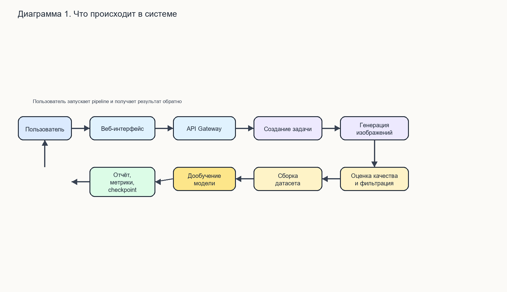
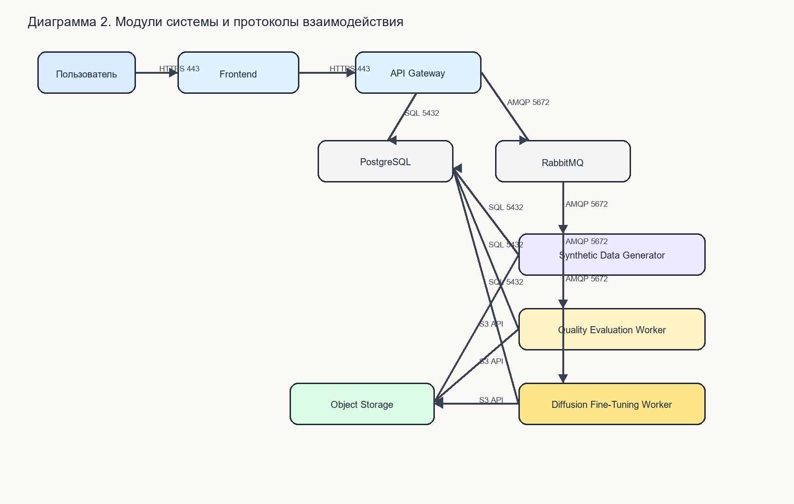
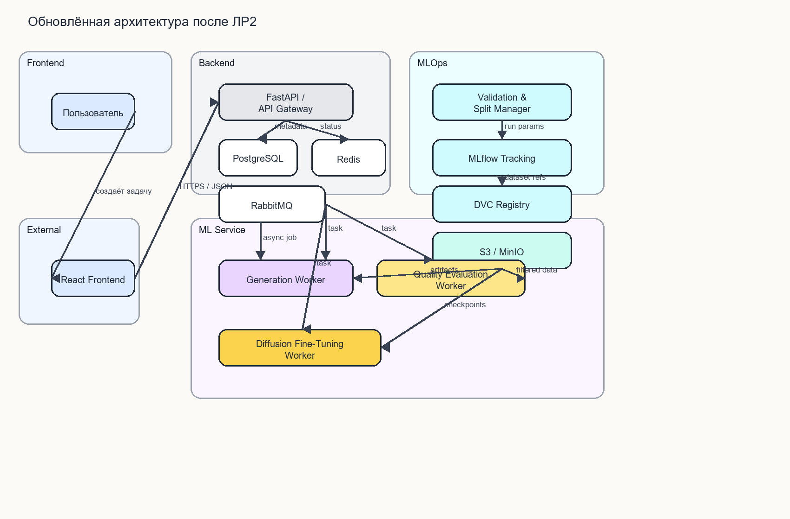
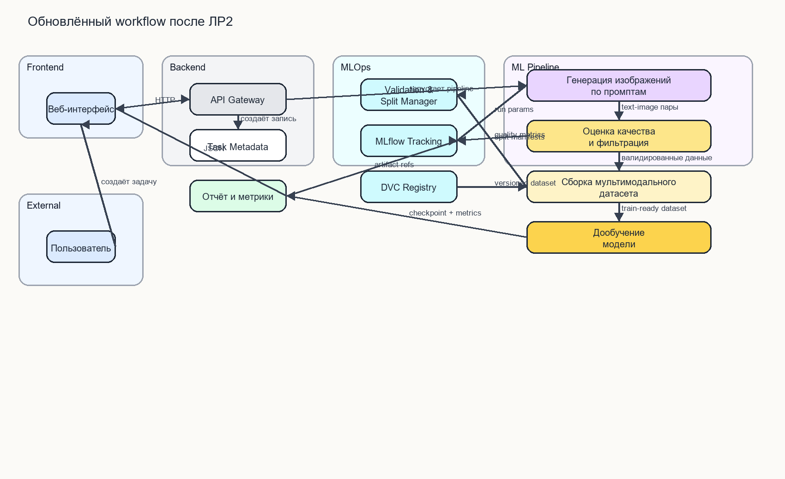
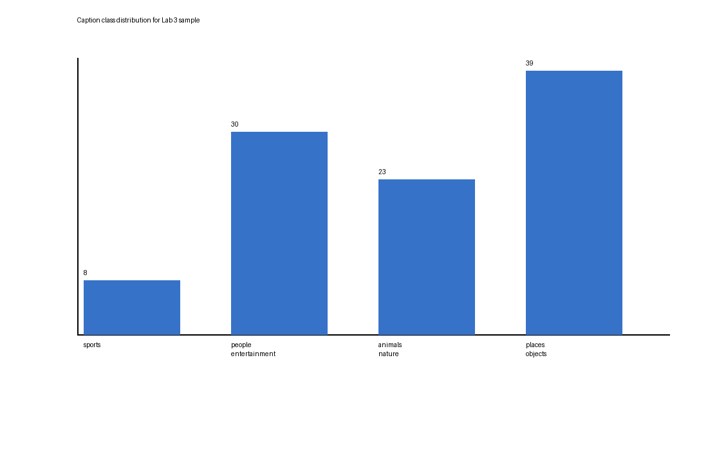
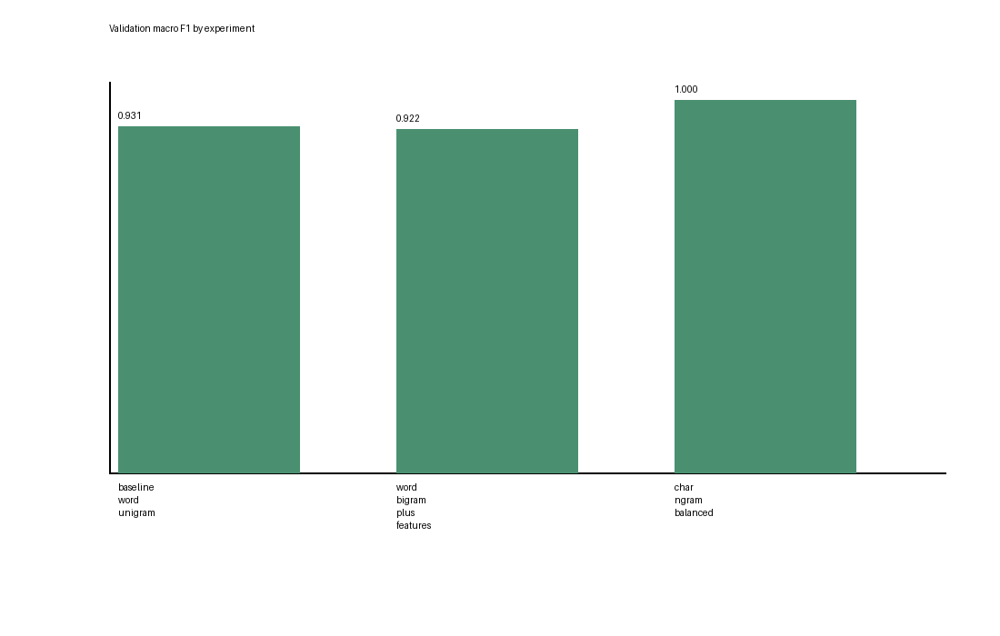
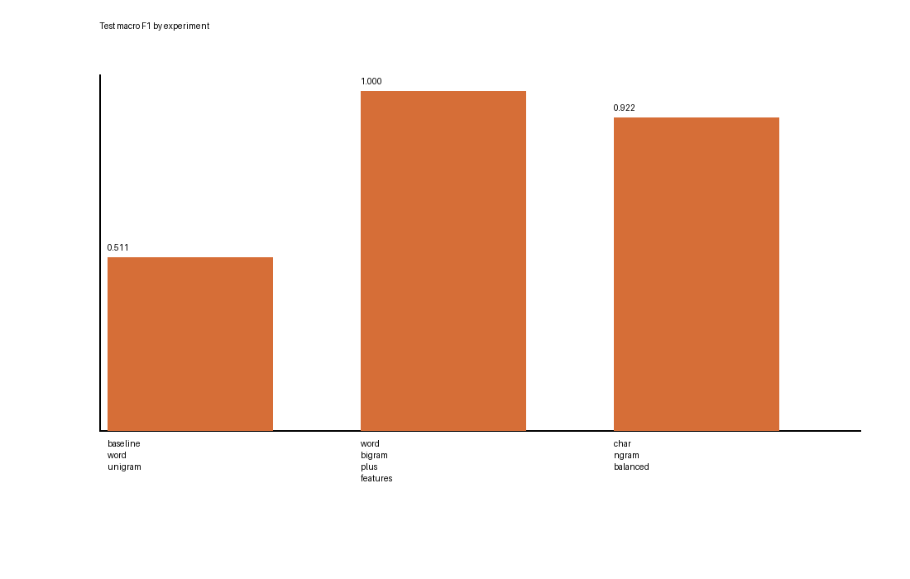
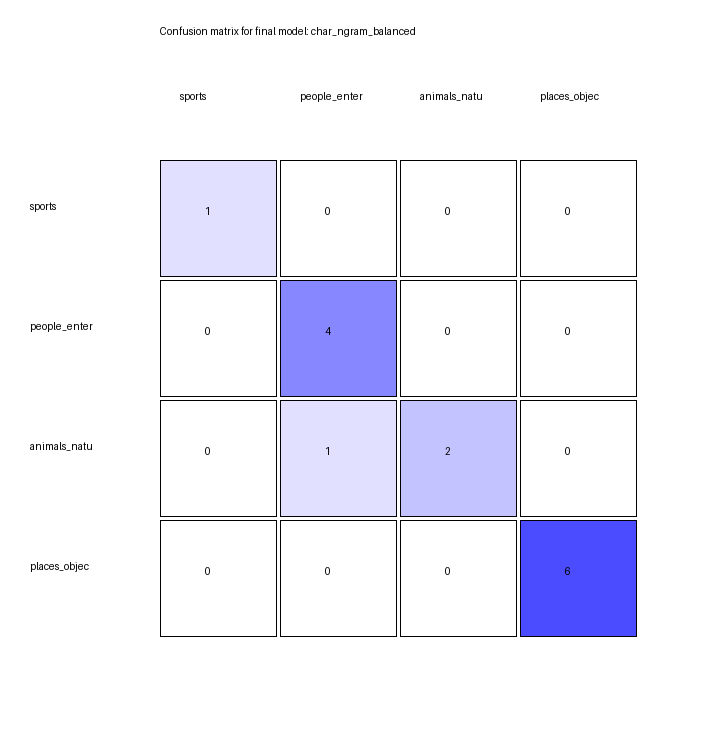
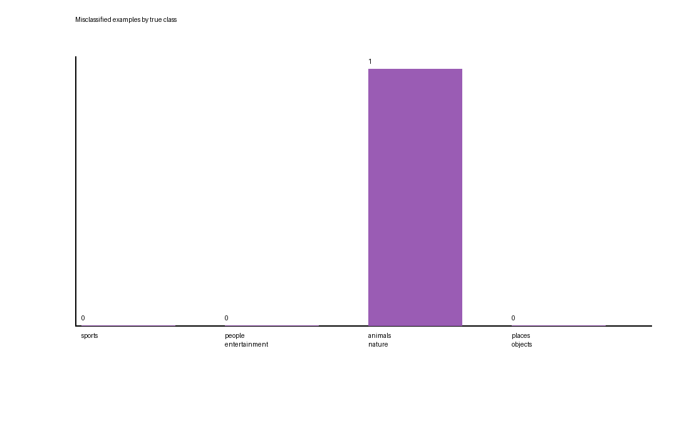
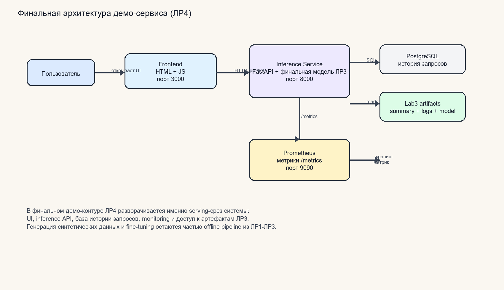

# Сервис генерации синтетических мультимодальных датасетов и дообучения диффузионных моделей

## Общее описание проекта

Проект посвящён проектированию и прототипированию ML-системы для генерации синтетических мультимодальных датасетов `text + image`, а также для последующего дообучения diffusion-моделей. В финальной демонстрационной версии из ЛР4 развёрнут **serving-контур** системы: пользовательский интерфейс, инференс-модуль на основе финальной модели ЛР3, база данных истории запросов и мониторинг.

## Быстрый запуск через Docker

### Минимальные требования

- Docker `29+`
- Docker Compose `v2+`

### Команда запуска

```bash
docker compose up --build
```

После запуска сервисы доступны по адресам:

- UI: `http://localhost:3000`
- Inference API: `http://localhost:8000`
- Swagger UI: `http://localhost:8000/docs`
- Prometheus: `http://localhost:9090`

### Что поднимается

- `frontend` — веб-интерфейс для отправки caption и просмотра результатов;
- `inference-service` — FastAPI-сервис с финальной моделью ЛР3;
- `postgres` — база данных для хранения истории предсказаний;
- `prometheus` — сбор метрик `/metrics`.

## Примеры использования

### Ручной запрос к API

```bash
curl -X POST "http://localhost:8000/predict" \
  -H "Content-Type: application/json" \
  -d "{\"caption\": \"american football player on the field during joint training camp .\"}"
```

### Просмотр истории предсказаний

```bash
curl "http://localhost:8000/history?limit=10"
```

### Просмотр summary экспериментов ЛР3

```bash
curl "http://localhost:8000/experiments/summary"
```

## Ссылки на диаграммы и документацию

- ЛР1, high-level workflow: [lr1_workflow_diagram.png](lr1_workflow_diagram.png)
- ЛР1, модули и протоколы: [lr1_modules_protocols_diagram.png](lr1_modules_protocols_diagram.png)
- ЛР2, обновлённая архитектура: [lr2_architecture_diagram.png](lr2_architecture_diagram.png)
- ЛР2, обновлённый workflow: [lr2_workflow_diagram.png](lr2_workflow_diagram.png)
- ЛР4, финальная demo-архитектура: [lr4_deployment_diagram.png](lr4_deployment_diagram.png)

## Шаг 1. Выбор темы

**Выбранная тема:** Сервис генерации синтетических мультимодальных датасетов (текст + изображения) с дообучением диффузионных моделей

## Шаг 2. Формулировка бизнес-задачи и её ML-интерпретация

### 1) Какую проблему решает сервис?

Сервис решает проблему нехватки качественных размеченных мультимодальных данных для обучения и адаптации генеративных моделей. Во многих прикладных задачах собрать пары «текстовое описание - изображение» дорого, долго и юридически рискованно. Кроме того, реальные датасеты часто несбалансированы: в них мало редких классов, доменных сценариев и специальных визуальных условий. В результате модели хуже работают на целевой предметной области.

### 2) Какую выгоду он несет, и кто её получит?

-   **Выгода:** Снижение стоимости подготовки датасета, ускорение итераций в ML-разработке, покрытие редких сценариев, повышение качества доменно-специфичных генеративных моделей.

-   **Бенефициары:**

    -   ML-инженеры и исследователи - получают инструмент для быстрого построения обучающих выборок.
    -   Компания или лаборатория - сокращает затраты на ручную разметку и закупку данных.
    -   Аналитики качества - получают контролируемый конвейер генерации и валидации синтетических данных.

### 3) Зачем тут ML? Какая его функция?

ML является ядром сервиса. Диффузионная модель используется для генерации изображений по текстовым промптам, а сопутствующие модели качества оценивают соответствие изображения тексту, разнообразие выборки и пригодность данных для дообучения. Далее на синтетическом или смешанном датасете выполняется дообучение базовой diffusion-модели под конкретный домен.

### 4) Какие входные и выходные данные предполагаются?

**Входные данные:**

-   Набор текстовых промптов или шаблонов промптов.
-   Небольшой реальный seed-датасет пар `text-image` для калибровки и валидации.
-   Конфигурация генерации: стиль, домен, разрешение, число изображений на промпт, negative prompts.
-   Параметры дообучения модели: checkpoint базовой модели, learning rate, число эпох, batch size, LoRA/finetuning режим.

**Выходные данные:**

-   Синтетический мультимодальный датасет: изображения, тексты, метаданные и quality scores.
-   Отфильтрованный train/validation split.
-   Дообученный checkpoint модели или LoRA-адаптер.
-   Отчёт о качестве датасета и модели: метрики, примеры, распределения, проблемные случаи.

## Шаг 3. Определение метрик качества

### Бизнес-метрики

1.  **Стоимость одного валидного примера датасета:**  
    отношение общих вычислительных и операционных затрат к числу примеров, прошедших quality filter.  
    Цель - сделать подготовку данных дешевле ручного сбора и разметки.

2.  **Время подготовки датасета:**  
    полное время от загрузки конфигурации до получения готового train-ready набора.  
    Чем меньше этот показатель, тем быстрее исследовательские итерации.

3.  **Прирост качества downstream-модели:**  
    изменение пользовательских или экспертных оценок после дообучения на синтетических данных.  
    Это главная прикладная метрика полезности сервиса.

**Как качество модели влияет на бизнес:**  
Если синтетические данные нерелевантны, шумны или однообразны, дообучение может ухудшить итоговую модель и привести к лишним вычислительным затратам. Если же данные хорошо соответствуют целевому домену и покрывают редкие случаи, компания получает более точную и полезную генеративную систему при меньших расходах на сбор данных.

### ML-метрики

1.  **CLIPScore / Text-Image Similarity** - мера соответствия изображения текстовому описанию.  
    _Почему выбрана:_ Для мультимодального датасета важно, чтобы картинка действительно отражала промпт.  
    _Связь с бизнесом:_ Низкое соответствие ухудшает обучающую ценность примеров и снижает качество дообученной модели.

2.  **FID (Fréchet Inception Distance)** - расстояние между распределением синтетических и целевых изображений.  
    _Почему выбрана:_ Позволяет оценить реалистичность и близость генерации к нужному визуальному домену.  
    _Связь с бизнесом:_ Слишком большой FID означает, что модель генерирует «не тот» стиль или домен, а значит данные плохо подходят для обучения.

3.  **Intra-dataset Diversity Score** - показатель разнообразия изображений и текстов внутри датасета.  
    _Почему выбрана:_ Важно не только качество отдельных примеров, но и отсутствие mode collapse.  
    _Связь с бизнесом:_ Низкое разнообразие приводит к переобучению и слабой обобщающей способности модели.

4.  **Validation Loss / Preference Score после дообучения** - качество уже адаптированной diffusion-модели.  
    _Почему выбрана:_ Сервис создаётся не только ради данных, но и ради улучшения модели.  
    _Связь с бизнесом:_ Если метрики после fine-tuning не улучшаются, значит конвейер генерации не приносит практической пользы.

## Шаг 4. Источник данных и EDA

### 4.1 Источник данных

В качестве базового seed-датасета выбран **Conceptual Captions**. Это открытый мультимодальный датасет пар `изображение + текстовое описание`, который далее дополняется синтетическими примерами, сгенерированными diffusion-моделью.

Для проекта используется следующая схема данных:

-   **Базовый реальный датасет:** Conceptual Captions.
-   **Синтетическое расширение:** пары `prompt + generated image`, созданные после запуска генеративного пайплайна.
-   **Метаданные генерации для синтетической части:** `prompt`, `negative_prompt`, `seed`, `guidance_scale`, `num_inference_steps`, `model_version`, `resolution`, `style_tag`, `domain_tag`, `clip_score`, `quality_flag`.

Основные характеристики базового датасета:

-   **Тип данных:** мультимодальный, полуструктурированный.
-   **Единица наблюдения:** одна пара `текст - изображение`.
-   **Содержимое записи:** `image_url`, `caption`.
-   **Роль в проекте:** используется как стартовый реальный корпус, на основе которого выполняется анализ, фильтрация и последующее синтетическое расширение.
-   **Преимущество выбора:** это реальный датасет, поэтому на защите удобно показать, что синтетические данные не заменяют исходный корпус, а расширяют его.

### 4.2 Разведочный анализ данных (EDA)

#### 4.2.1 Первичный обзор

Для EDA был выполнен реальный кодовый анализ выборки из **200 записей** датасета Conceptual Captions, полученных через Hugging Face dataset server. На этом этапе анализировались доступные метаданные `caption` и `image_url`, так как исходный датасет очень большой и для учебного проекта достаточно показать EDA на рабочем сэмпле.

Результаты первичного обзора:

-   Размер анализируемой выборки: **200 строк**.
-   Средняя длина подписи: **9.74 слова**.
-   Медианная длина подписи: **9 слов**.
-   Средняя длина подписи в символах: **55.45**.
-   Минимальная длина подписи: **4 слова**.
-   Максимальная длина подписи: **30 слов**.
-   Количество уникальных доменов-источников изображений в выборке: **90**.

Вывод: даже на небольшом сэмпле видно, что датасет достаточно разнообразен по источникам и содержит короткие естественные описания, хорошо подходящие для задачи `text-image`.

#### 4.2.2 Baseline-метрики для сравнения с синтетическим датасетом

Так как далее сервис будет генерировать синтетические пары `текст + изображение`, в EDA полезно сразу зафиксировать базовые метрики реального seed-датасета, с которыми потом можно сравнивать синтетику.

Для текущей выборки получены следующие baseline-показатели:

-   Уникальных caption: **200 из 200**, дубликатов в сэмпле не найдено.
-   Доля дубликатов caption: **0.0%**.
-   Лексическое разнообразие текста: **0.6542**.
-   Доля коротких caption (меньше 6 слов): **14.5%**.
-   Доля длинных caption (больше 20 слов): **3.0%**.
-   Быстрая проверка доступности `image_url` на подвыборке из 20 ссылок показала **60% валидных URL**.

Эти показатели важны, потому что позже аналогичные метрики можно посчитать уже на синтетическом датасете и проверить:

-   не ухудшилось ли разнообразие текста;
-   не выросла ли доля дубликатов;
-   не появилось ли сильное смещение по тематикам;
-   не стало ли слишком много технически невалидных объектов.

#### 4.2.3 Очистка и подготовка

На этапе подготовки данных предполагаются следующие шаги:

-   удаление строк с пустыми или слишком короткими caption;
-   фильтрация битых и недоступных изображений по `image_url`;
-   нормализация текста: приведение к единому регистру, удаление лишних пробелов и мусорных токенов;
-   дедупликация пар с одинаковыми или почти одинаковыми caption;
-   формирование train/validation split;
-   добавление синтетической части датасета после генерации новых `text-image` пар.

Такой pipeline позволяет использовать Conceptual Captions как реальную основу, а затем расширить его синтетикой без смешения “сырого” и “очищенного” корпусов.

#### 4.2.4 Визуализация и анализ

**Распределение длины caption**


По графику видно, что большинство подписей лежит в диапазоне примерно от 5 до 12 слов. Это означает, что датасет содержит короткие описания объектов и сцен, что удобно для обучения text-to-image моделей.

**Топ доменов-источников изображений**


Наиболее часто в сэмпле встречаются домены `alamy`, `pinimg`, `gettyimages` и другие крупные источники изображений. Это показывает, что данные собраны из множества внешних сайтов, а значит требуют проверки качества и доступности ссылок.

**Самые частые содержательные слова в caption**


Частые слова вроде `person`, `background`, `white`, `team`, `football`, `player`, `car` показывают, что в выборке много описаний людей, событий, спортивных сцен и типовых объектов. Это полезно для понимания смещения датасета: без дополнительной балансировки модель может чаще видеть именно такие сюжеты.

**Проверка доступности изображений по `image_url`**


Даже на маленькой проверочной подвыборке видно, что часть ссылок уже недоступна. Для Conceptual Captions это важный практический вывод: перед обучением обязательно нужен этап фильтрации битых URL, иначе в train-ready набор попадут неполные записи.

**Приближенное распределение по тематикам**


Грубая тематическая разметка по ключевым словам показывает, что в сэмпле заметно преобладают описания людей и общих сцен, а спортивные сюжеты встречаются редко. Этот график полезен как baseline: потом можно сравнить его с синтетическим датасетом и проверить, не усилили ли мы тематический перекос.

#### 4.2.5 Агрегация данных для ML-модели

После очистки и расширения синтетическими примерами для дообучения diffusion-модели формируется обучающий набор следующего вида:

-   `image_path` - путь к изображению.
-   `text_caption` - итоговый текстовый промпт.
-   `domain_tag` - доменная метка.
-   `style_tag` - метка стиля.
-   `quality_score` - агрегированный score пригодности.
-   `source_type` - `real` или `synthetic`.

Дополнительно возможна балансировка:

-   по редким классам;
-   по визуальным стилям;
-   по длине и структуре текстового описания;
-   по source_type для смешанного обучения.

### 4.3 Выводы

-   Conceptual Captions подходит как базовый реальный датасет для проекта, потому что уже содержит пары `текст + изображение`.
-   Даже на сэмпле из 200 строк видно, что подписи компактны, а источники изображений разнообразны.
-   В датасете заметен перекос в сторону людей, событий и стоковых сцен, поэтому синтетическое расширение можно использовать для балансировки нужных доменных случаев.
-   Такой подход хорошо ложится на задачу ML System Design: сначала берётся реальный seed-датасет, затем он очищается, анализируется и дополняется синтетическими данными для дообучения diffusion-модели.

## Шаг 5. Проектирование высокоуровневой архитектуры системы

### 5.1 Общая идея системы

Система предоставляет пользователю интерфейс, в котором можно задать шаблоны промптов, параметры генерации и конфигурацию дообучения. После запуска пайплайна сервис асинхронно генерирует изображения, оценивает их качество, фильтрует неудачные примеры, собирает датасет, запускает fine-tuning диффузионной модели и сохраняет артефакты вместе с отчётом.

**Диаграмма 1. Что происходит в системе**



### 5.2 Основные сценарии работы

**5.2.1 Взаимодействие пользователя:**

1.  Пользователь задаёт параметры генерации датасета и загружает seed-данные через веб-интерфейс.
2.  Frontend отправляет конфигурацию в API Gateway.
3.  API создаёт задачу, сохраняет конфигурацию и публикует событие в очередь.
4.  Генератор синтетических данных создаёт пары `text-image`.
5.  Модуль quality evaluation фильтрует и ранжирует примеры.
6.  Training worker запускает дообучение diffusion-модели.
7.  Пользователь получает `task_id`, следит за прогрессом и скачивает итоговый датасет, отчёт и checkpoint.

**5.2.2 Откуда поступают данные для обучения / инференса:**

-   **Генерация датасета:** из пользовательских промптов, шаблонов и seed-датасета.
-   **Оценка качества:** из embeddings текстов и изображений, а также вспомогательных quality models.
-   **Дообучение:** из отфильтрованного мультимодального датасета, собранного текущим pipeline run.

**5.2.3 Куда сохраняются результаты:**  
Метаданные задач и статусы сохраняются в PostgreSQL. Изображения, датасеты, checkpoints и отчёты сохраняются в объектном хранилище. Краткие аналитические сводки и метрики сохраняются в таблицах `datasets`, `training_runs`, `artifacts`, `quality_reports`.

## Шаг 6. Выделение модулей и протоколов взаимодействия

### 6.1 Модули и их ответственность

**Диаграмма 2. Модули системы и протоколы взаимодействия**



1.  **Модуль пользовательского интерфейса (Frontend)**  
    _Ответственность:_ Настройка генерации, запуск пайплайна, просмотр прогресса, просмотр quality report и скачивание артефактов.  
    _Протоколы взаимодействия:_ HTTPS (REST/JSON) с API Gateway.

2.  **Модуль API Gateway**  
    _Ответственность:_ Приём запросов, валидация конфигураций, создание задач, управление статусами, выдача ссылок на артефакты.  
    _Протоколы взаимодействия:_ HTTPS для фронтенда, AMQP для публикации задач, SQL для записи метаданных.

3.  **Модуль генерации синтетических данных**  
    _Ответственность:_ Генерация изображений по промптам с помощью базовой diffusion-модели, сохранение изображений и метаданных.  
    _Протоколы взаимодействия:_ Получение задач через очередь, запись артефактов в object storage, сохранение статусов в PostgreSQL.

4.  **Модуль оценки качества**  
    _Ответственность:_ Подсчёт CLIPScore, фильтрация нежелательных примеров, дедупликация, расчёт diversity metrics.  
    _Протоколы взаимодействия:_ Чтение артефактов из object storage, запись quality report в PostgreSQL и storage.

5.  **Модуль дообучения diffusion-модели**  
    _Ответственность:_ Подготовка train-ready датасета, запуск fine-tuning или LoRA-tuning, логирование метрик, сохранение checkpoints.  
    _Протоколы взаимодействия:_ Чтение датасета из storage, запись метрик в PostgreSQL, сохранение модели в storage.

6.  **Модуль хранения данных**  
    _Ответственность:_ PostgreSQL хранит задачи, метрики, конфигурации и ссылки на артефакты; object storage хранит изображения, датасеты и модели.  
    _Протоколы взаимодействия:_ SQL и S3-compatible API.

### 6.2 Последовательность выполнения пайплайна

1.  Пользователь создаёт новый pipeline run через Frontend.
2.  API Gateway сохраняет конфигурацию и публикует задачу в RabbitMQ.
3.  Synthetic Data Generator генерирует изображения по промптам и сохраняет результаты в object storage.
4.  Quality Evaluation Worker вычисляет quality metrics, выполняет фильтрацию и формирует финальный датасет.
5.  Fine-Tuning Worker запускает дообучение diffusion-модели на подготовленном наборе данных.
6.  После завершения обучения сохраняются checkpoint, метрики и визуальный отчёт.
7.  Пользователь через API и Frontend получает доступ к датасету, метрикам и итоговой модели.

## Шаг 7. Предварительный выбор технологий и их обоснование

### 7.1 Frontend (React + TypeScript)

**Выбор:** React с TypeScript.  
**Обоснование:** Подходит для формы конфигурации сложного ML-пайплайна, отображения статусов задач, таблиц метрик и галерей изображений. TypeScript помогает контролировать типы API-ответов и конфигураций.  
**Отвергнутые альтернативы:** Vue.js - тоже подходит, но React чаще встречается в учебных и production ML-панелях; Angular - избыточен для проекта такого масштаба.

### 7.2 API Gateway (FastAPI)

**Выбор:** Python + FastAPI.  
**Обоснование:** В этом проекте логично использовать единый стек вокруг Python, так как генерация, оценка качества и fine-tuning тоже выполняются на Python. FastAPI даёт удобную типизацию, OpenAPI-документацию и быстрый старт.  
**Отвергнутые альтернативы:** Go дал бы лучшую производительность, но усложнил бы стек; Node.js менее естественен для плотной интеграции с ML-пайплайном.

### 7.3 Очередь сообщений (RabbitMQ)

**Выбор:** RabbitMQ.  
**Обоснование:** Сервис состоит из нескольких асинхронных этапов: генерация, оценка, обучение. RabbitMQ хорошо подходит для orchestration очередей задач и повторных попыток.  
**Отвергнутые альтернативы:** Kafka избыточен для учебного пайплайна; Redis Queue проще, но слабее как надёжная очередь для многошаговых задач.

### 7.4 База данных (PostgreSQL)

**Выбор:** PostgreSQL.  
**Обоснование:** Нужна надёжная реляционная база для хранения задач, конфигураций запусков, quality reports и ссылок на артефакты. PostgreSQL удобен для аналитических запросов и хорошо сочетается с JSON-полями.  
**Отвергнутые альтернативы:** MongoDB менее удобен для связанного хранения run metadata; SQLite не подходит для многопользовательского сервиса.

### 7.5 Объектное хранилище (S3/MinIO)

**Выбор:** S3-compatible storage, например MinIO локально или Amazon S3 в облаке.  
**Обоснование:** Изображения, архивы датасетов и checkpoints слишком велики для хранения в БД. Object storage лучше подходит для крупных бинарных артефактов.  
**Отвергнутые альтернативы:** Хранение файлов на локальном диске плохо масштабируется и осложняет переносимость системы.

### 7.6 ML-воркеры (Python, PyTorch, Diffusers)

**Выбор:** Python + PyTorch + Hugging Face Diffusers.  
**Обоснование:** Это де-факто стандарт для diffusion-моделей, генерации изображений и fine-tuning через LoRA, DreamBooth или кастомные training loops. Экосистема богата готовыми компонентами и примерами.  
**Отвергнутые альтернативы:** TensorFlow реже используется для современных diffusion pipelines; самописная реализация без Diffusers слишком трудоёмка для учебного проекта.

### 7.7 Оценка качества (CLIP, OpenCLIP, torchvision, faiss)

**Выбор:** CLIP/OpenCLIP для text-image similarity, `torchvision` для image preprocessing, `faiss` для поиска дубликатов и близких embedding-векторов.  
**Обоснование:** Эти инструменты позволяют реализовать фильтрацию, дедупликацию и quality scoring в одном Python-стеке.  
**Отвергнутые альтернативы:** Полностью ручная экспертная оценка не масштабируется; более тяжёлые multimodal evaluators избыточны для учебной системы.

### 7.8 Контейнеризация и оркестрация (Docker, Docker Compose)

**Выбор:** Docker и Docker Compose.  
**Обоснование:** Позволяют воспроизводимо поднимать API, БД, очередь, object storage и воркеры. Для учебного проекта этого достаточно.  
**Отвергнутые альтернативы:** Kubernetes слишком сложен для первой версии и увеличивает инфраструктурную нагрузку без существенной пользы для зачётного проекта.

### 7.9 Мониторинг экспериментов (MLflow или Weights & Biases)

**Выбор:** MLflow как базовый вариант.  
**Обоснование:** Нужно логировать параметры генерации, конфигурации fine-tuning, метрики качества и ссылки на checkpoints. MLflow хорошо подходит для учебной демонстрации полного experiment tracking контура.  
**Отвергнутые альтернативы:** Ведение логов только в файлах неудобно для сравнения запусков; Weights & Biases тоже хорош, но требует внешней интеграции и аккаунта.

---

# Лабораторная работа №2
## Корректировка архитектуры системы на основе стратегии валидации, воспроизводимости, масштабируемости

**ФИО:** `<ФИО>`

**Группа:** `<Группа>`

## Шаг 1. Стратегия валидации и воспроизводимость

### 1.1 Стратегия валидации

Для сервиса генерации синтетического мультимодального датасета и дообучения diffusion-модели нельзя использовать случайный `train/validation/test split` по отдельным строкам датасета. Причина в том, что синтетические данные часто содержат:

- почти одинаковые prompt-шаблоны;
- визуально близкие изображения, сгенерированные одной и той же моделью;
- кластеры данных, построенные вокруг одного объекта, сцены или стиля;
- реальные seed-примеры и синтетические варианты, семантически очень близкие друг к другу.

Если такие объекты попадут одновременно в train и test, метрики будут завышены, а модель покажется лучше, чем она есть на самом деле.

Поэтому для нашей задачи предлагается **групповая стратегия валидации**:

1. Сначала все примеры объединяются в `prompt-group`:
   один шаблон промпта, одна тема, один стиль, один domain tag.
2. Затем внутри датасета ищутся near-duplicate изображения:
   по perceptual hash или по CLIP-эмбеддингам.
3. После этого split выполняется **по группам, а не по отдельным примерам**.

Рекомендуемое разбиение:

- `train` — 70%
- `validation` — 15%
- `test` — 15%

Дополнительно для нашей задачи полезно вести **два тестовых среза**:

- `test_real` — небольшой hold-out из реальных seed-данных;
- `test_synth` — hold-out из синтетических данных, не пересекающийся по prompt-group с train.

Такой подход позволяет проверить:

- не переобучилась ли модель на синтетике;
- сохраняется ли качество на реальных данных;
- не происходит ли деградация генерации на новых prompt-группах.

### 1.2 Какие метрики считаем на validation/test

На этапе валидации и тестирования для нашей системы логично использовать:

- `CLIPScore / text-image similarity` — согласованность текста и изображения;
- `FID` или `KID` на hold-out наборе — реалистичность синтетических изображений;
- `Diversity score` — разнообразие сгенерированных изображений;
- `Duplicate rate` — доля дублей и near-duplicates;
- `Acceptance rate after filtering` — доля примеров, прошедших quality filter;
- `Training loss / validation loss` при fine-tuning;
- `Inference latency` для online-части API.

Тестовый набор должен быть **заморожен** и использоваться только для финальной проверки, а все выборы гиперпараметров должны делаться по `validation`.

### 1.3 Воспроизводимость экспериментов

Для воспроизводимости в нашей системе нужно версионировать не только код, но и данные, настройки генерации и артефакты обучения.

Обязательно версионируются:

- исходный seed-датасет;
- очищенный train-ready датасет;
- manifest-файлы разбиения на `train/validation/test`;
- prompt templates и negative prompts;
- правила фильтрации и quality thresholds;
- код обучения и генерации;
- commit hash репозитория;
- версия базовой diffusion-модели;
- итоговые checkpoints / LoRA adapters;
- конфигурация обучения:
  learning rate, batch size, epochs, resolution, guidance scale, scheduler, seed;
- версия окружения:
  Python, PyTorch, Diffusers, CUDA, Docker image tag;
- метрики и логи экспериментов.

### 1.4 Инструменты воспроизводимости

Для нашей системы предлагается такой контур:

- `Git` — версионирование кода и документации;
- `DVC` — версионирование датасетов, split-manifest и крупных артефактов;
- `MLflow` — логирование запусков, гиперпараметров, метрик и checkpoint-ссылок;
- `S3/MinIO` — хранение изображений, датасетов и чекпоинтов;
- `Docker` — фиксация runtime-окружения;
- фиксированные `random seeds` — воспроизводимость генерации и fine-tuning.

### 1.5 Почему эта стратегия подходит именно для нашей задачи

Для tabular-задач случайный split часто приемлем, но для синтетического multimodal-пайплайна он слишком оптимистичен. Наша система генерирует данные блоками, и именно эти блоки нужно разносить по split-ам целиком. Это снижает риск “утечки похожести” между train и test и делает итоговую оценку честнее.

## Шаг 2. Анализ утечек данных

Ниже перечислены основные риски утечек данных для нашей предметной области.

### 2.1 Риск: одинаковые или очень близкие prompt-шаблоны в train и test

**Почему это проблема:**  
Если модель дообучалась на формулировках, почти совпадающих с тестовыми промптами, то test-метрики будут завышены.

**Как предотвращаем:**

- split по `prompt-group`, а не по отдельным строкам;
- отдельное хранение manifest-файлов train/val/test;
- ручная проверка топовых prompt-кластеров перед финальным запуском.

### 2.2 Риск: near-duplicate изображения в разных split

**Почему это проблема:**  
Diffusion-модель может генерировать очень похожие изображения при близких seed и prompt, а значит test перестаёт быть независимым.

**Как предотвращаем:**

- perceptual hashing;
- поиск похожих изображений через CLIP-эмбеддинги;
- удаление дублей до формирования split;
- запрет попадания одной duplicate-group в разные части датасета.

### 2.3 Риск: утечка через реальные seed-данные

**Почему это проблема:**  
Если в train и test одновременно попадают реальные примеры и их синтетические вариации, модель фактически видит тестовые объекты заранее.

**Как предотвращаем:**

- группировка синтетики по `source_id` исходного seed-примера;
- split по source-группам;
- отдельный hold-out real-only benchmark.

### 2.4 Риск: утечка через ручной подбор промптов по test-результатам

**Почему это проблема:**  
Если тестовый набор используется для подбора prompt templates, guidance scale или фильтрации, происходит переобучение на тесте.

**Как предотвращаем:**

- все tuning-решения принимаются только по validation;
- test используется один раз в конце;
- изменения prompt templates фиксируются как новая версия эксперимента.

### 2.5 Риск: утечка через метаданные

**Почему это проблема:**  
Названия файлов, source domain, служебные теги или пути хранения могут содержать информацию, по которой модель или pipeline косвенно распознаёт split.

**Как предотвращаем:**

- унификация naming convention;
- отделение служебных metadata от model input;
- хранение split-информации в manifest, а не в имени файла.

### 2.6 Риск: утечка из-за повторного использования test при долгом цикле разработки

**Почему это проблема:**  
Если тестовый набор много раз проверяется вручную, команда постепенно подгоняет систему под него.

**Как предотвращаем:**

- замороженный `test`;
- отдельный `validation`;
- финальный benchmark запускается только перед релизом модели;
- результаты теста логируются и аудируются в MLflow.

## Шаг 3. Масштабирование

### 3.1 Предполагаемая нагрузка

Наша система не является realtime text-to-image сервисом для миллионов пользователей. Это сервис оркестрации генерации датасета, фильтрации и fine-tuning, поэтому нагрузка распределяется между:

- лёгким online API;
- тяжёлыми асинхронными ML-задачами.

#### Online API

- создание задачи генерации / обучения:
  средняя нагрузка `1-2 RPS`, пиковая `10 RPS`;
- запрос статуса задачи:
  средняя нагрузка `3-5 RPS`, пиковая `20 RPS`;
- получение отчёта и метрик:
  средняя нагрузка `1 RPS`, пиковая `5 RPS`.

#### Внутренний ML pipeline

- генерация изображений:
  пачки по `100-1000` изображений на задачу;
- фильтрация:
  батчевый GPU/CPU processing;
- fine-tuning:
  долгие job-ы длительностью от десятков минут до нескольких часов.

### 3.2 Средний и пиковый трафик

Для внешнего API трафик небольшой:

- запрос на создание задачи — `2-10 KB`;
- ответ со статусом — `1-5 KB`;
- отчёт по задаче — `10-100 KB`, если без тяжёлых артефактов.

Основной трафик внутри системы создают:

- загрузка и сохранение изображений в object storage;
- сохранение checkpoint-файлов;
- чтение train-ready датасетов воркерами.

Оценка внутреннего трафика:

- средний — `10-30 MB/s`;
- пиковый — `100-300 MB/s` при одновременной генерации и записи артефактов.

### 3.3 Допустимый latency

Для нашей задачи важно разделять latency по типам операций:

- `POST /tasks` — до `200-300 ms`;
- `GET /tasks/{id}/status` — до `100-200 ms`;
- `GET /tasks/{id}/report` — до `500-1000 ms`;
- генерация изображений — асинхронно, SLA в минутах;
- fine-tuning — асинхронно, SLA в десятках минут или часах.

То есть для нас критична не мгновенная генерация результата, а:

- быстрое принятие задания системой;
- быстрый ответ по статусу;
- устойчивость долгих ML-job-ов.

### 3.4 Как система масштабируется

Для нашей задачи оптимальна **комбинация синхронной и асинхронной архитектуры**:

- синхронно работают UI и API для создания задач и получения статуса;
- асинхронно работают generation / evaluation / training workers.

#### Подход к масштабированию

1. `API Gateway` масштабируется горизонтально:
   несколько инстансов за load balancer.
2. `RabbitMQ` буферизует тяжёлые задачи:
   API не ждёт окончания генерации или обучения.
3. `GenWorker`, `EvalWorker`, `TrainWorker` масштабируются независимо:
   можно отдельно увеличивать число CPU/GPU-воркеров.
4. `Redis` используется для быстрых status/read операций:
   чтобы не нагружать PostgreSQL частыми polling-запросами.
5. `Object Storage` масштабируется отдельно от вычислений:
   изображения и checkpoints не хранятся в основной БД.

### 3.5 Почему выбран именно такой паттерн

Синхронный inference здесь не подходит как основной паттерн, потому что:

- генерация изображения и fine-tuning долгие;
- пользователь не должен держать HTTP-соединение открытым десятки минут;
- тяжёлые операции лучше ставить в очередь и исполнять воркерами.

Поэтому основа архитектуры:

- `async job submission`;
- `queue-based processing`;
- `horizontal scaling` воркеров;
- `cache for task status`;
- `object storage for large artifacts`.

Если latency у status API вырастет выше допустимого, мы:

- добавим Redis cache;
- уменьшим частоту polling;
- введём pagination и лёгкие summary-ответы;
- вынесем тяжёлую агрегацию отчётов в background materialization.

## Шаг 4. Корректировка архитектуры системы и стека

На основе решений из шагов 1-3 в архитектуру ЛР1 добавляются новые компоненты:

- `Validation & Split Manager`;
- `DVC dataset registry / remote`;
- `MLflow tracking server`;
- `Redis cache` для статусов и отчётов;
- versioned manifests для train/validation/test;
- отдельные metadata о reproducibility:
  seeds, config version, dataset version, model version.

### 4.1 Обновлённая архитектурная диаграмма



### 4.2 Корректировка workflow



### 4.3 Изменения в технологическом стеке

#### Новые компоненты

- `Redis`:
  кэширование статусов задач и быстрых summary-отчётов.
- `DVC`:
  версионирование dataset snapshot, split manifests и крупных артефактов.
- `MLflow`:
  хранение run metadata, гиперпараметров, metric history и artifact links.

#### Почему стек изменился

- В ЛР1 архитектура была достаточной для high-level описания pipeline.
- В ЛР2 нам нужно явно закрыть reproducibility и validation.
- Поэтому появились компоненты, отвечающие не за “бизнес-функцию”, а за инженерную надёжность ML-системы.

## Ответы на вопросы для самопроверки

### Как проверить, что стратегия валидации не приводит к переобучению на тесте?

- тестовый набор замораживается и не используется для tuning;
- split делается по группам, а не по строкам;
- проверяются near-duplicates между train и test;
- все гиперпараметры выбираются по validation.

### Как обеспечивать воспроизводимость, если модель обучается долго?

- фиксировать commit hash, dataset version, model version и random seed;
- сохранять Docker image tag;
- логировать параметры и промежуточные checkpoints в MLflow;
- хранить dataset и checkpoints в DVC/S3.

### Как хранить логи экспериментов и артефакты?

- metadata и метрики — в `MLflow`;
- большие файлы — в `S3/MinIO`;
- ссылки на артефакты и версии — в PostgreSQL и DVC manifest.

### Какие виды утечек характерны для нашей предметной области?

- одинаковые prompt templates в разных split;
- near-duplicate изображения;
- пересечение real seed и synthetic variations;
- повторное использование test для prompt engineering.

### Если latency выше допустимого, какие шаги предпринять?

- перевести тяжёлые операции в async jobs;
- добавить Redis cache для статусов;
- увеличить число API-инстансов;
- горизонтально масштабировать worker pool;
- уменьшить размер синхронных ответов и вынести тяжёлую агрегацию в background.

## Источники

- [MLflow Tracking Documentation](https://www.mlflow.org/docs/latest/ml/tracking)
- [DVC Documentation: Get Started](https://dvc.org/doc/start)
- [DVC Use Case: Versioning Data and Models](https://dvc.org/doc/use-cases/versioning-data-and-models)
- [RabbitMQ Work Queues](https://www.rabbitmq.com/tutorials/tutorial-two-python)

# Лабораторная работа №3

## Моделирование, эксперименты и анализ ошибок

**ФИО:** `<ФИО>`

**Группа:** `<Группа>`

### Что именно моделируется в рамках ЛР3

Так как основная система посвящена генерации синтетических мультимодальных датасетов и дообучению diffusion-моделей, в данной лабораторной реализована **вспомогательная production-ready ML-модель сервиса**: лёгкий классификатор caption, который автоматически предсказывает `domain_tag` по текстовому описанию. Такая модель нужна в сервисе для:

- маршрутизации промптов по доменным корзинам;
- балансировки train-ready датасета;
- быстрого quality control до запуска тяжёлой генерации и fine-tuning.

В результате ЛР3 реализуется не сама diffusion-модель, а лёгкий inference-модуль, который реалистично можно встроить в backend сервиса.

## Шаг 1. Подготовка данных

### Использованные данные

Для экспериментов был использован реальный сэмпл из `100` caption датасета **Conceptual Captions**, сохранённый в файле:

- `lab3/data/conceptual_captions_sample_100.tsv`

Код подготовки данных и всех дальнейших экспериментов зафиксирован в:

- `lab3/run_lab3.py`

### Предобработка

В коде реализованы следующие шаги подготовки:

- загрузка caption из TSV;
- нормализация текста: lower-case, очистка лишних символов, нормализация пробелов;
- exact deduplication caption;
- weak labeling по доменным корзинам `sports`, `people_entertainment`, `animals_nature`, `places_objects`;
- маскирование самых «протекающих» placeholder-токенов (`person`, `actor`, `artist`, `sports_team`) в признаковом пространстве, чтобы модель не решала задачу слишком тривиально;
- формирование `group_key` для grouped split;
- стратифицированное разбиение по группам на `train / val / test`.

### Стратегия split

Разбиение выполнено в соответствии с идеей ЛР2: похожие caption должны попадать в один split. Для этого для каждого примера строится `group_key`, после чего делается **group-aware stratified split**.

Итоговое разбиение:

- `train`: `72` примера
- `val`: `14` примеров
- `test`: `14` примеров

Распределение классов по всему сэмплу:

- `places_objects`: `39`
- `people_entertainment`: `30`
- `animals_nature`: `23`
- `sports`: `8`

**График распределения классов**


### Feature engineering

Помимо TF-IDF признаков, в некоторых экспериментах использовались дополнительные признаки:

- длина caption в словах;
- длина caption в символах;
- наличие `!`;
- признаки наличия доменных паттернов;
- признаки placeholder-токенов после нормализации.

## Шаг 2. Выбор и реализация baseline-модели

### Baseline

В качестве baseline выбрана простая модель для текстовой задачи:

- **TF-IDF по word unigram**
- **линейная softmax regression**, реализованная в `numpy`

Это соответствует идее «нижней границы качества»: модель лёгкая, быстрая, интерпретируемая и не требует тяжёлых зависимостей.

### Метрики baseline

Результаты baseline-эксперимента:

- `val accuracy`: `0.9286`
- `val macro F1`: `0.9308`
- `test accuracy`: `0.6429`
- `test macro F1`: `0.5110`
- `latency`: `0.0491 ms` на один caption

Вывод: baseline оказался достаточно простым, но заметно проседает на тесте, особенно на редких классах. Значит, он подходит как нижняя граница качества, но требует улучшений.

## Шаг 3. Настройка экспериментального пайплайна

### Что логируется

Для каждого эксперимента логируются:

- параметры модели;
- тип признаков;
- значения `accuracy`, `macro precision`, `macro recall`, `macro F1`;
- confusion matrix;
- latency;
- имя выбранной финальной модели.

### Где хранятся артефакты

- лог экспериментов: `lab3/artifacts/experiments/experiment_log.jsonl`
- итоговая сводка: `lab3/artifacts/lab3_summary.json`
- ошибки лучшей модели: `lab3/artifacts/experiments/best_model_errors.json`
- финальная модель: `lab3/artifacts/models/final_caption_router_model.npz`
- метаданные модели: `lab3/artifacts/models/final_caption_router_model_meta.json`

## Шаг 4. Проведение экспериментов

Были проведены три эксперимента.

| Эксперимент | Признаки / модель | Val macro F1 | Test macro F1 | Test accuracy | Latency |
| --- | --- | ---: | ---: | ---: | ---: |
| `baseline_word_unigram` | word unigram TF-IDF + softmax | `0.9308` | `0.5110` | `0.6429` | `0.0491 ms` |
| `word_bigram_plus_features` | word unigram+bigram TF-IDF + extra features | `0.9222` | `1.0000` | `1.0000` | `0.0987 ms` |
| `char_ngram_balanced` | char n-gram TF-IDF + extra features + class weights | `1.0000` | `0.9222` | `0.9286` | `0.1294 ms` |

**График качества на validation**


**График качества на test**


### Интерпретация результатов

- baseline переобучается на более простые паттерны и хуже переносится на test;
- добавление bigram и простых дополнительных признаков резко улучшает качество;
- char n-gram модель с class weights показывает лучший результат именно на validation, а значит по правилам честного model selection она и выбирается как финальная.

Важно: хотя `word_bigram_plus_features` показал идеальный результат на test, финальная модель не должна выбираться по test-метрике, иначе это уже будет подстройка под тест.

## Шаг 5. Анализ ошибок

Для финальной модели `char_ngram_balanced` был проведён анализ ошибок.

### Матрица ошибок



### Разбор ошибок по истинному классу



### Найденные слабые места

На тестовой выборке финальная модель ошиблась на одном примере:

- caption: `farm tractor is moving on the field , cultivating land`
- истинный класс: `animals_nature`
- предсказанный класс: `people_entertainment`

Причина ошибки:

- подпись относится к сельскохозяйственной сцене и находится на границе между классами `animals_nature` и `places_objects`;
- в caption нет явного животного объекта, поэтому weak label и сама модель сталкиваются с семантически неоднозначным случаем;
- сэмпл класса `sports` и вообще общий размер выборки малы, поэтому модель учится на ограниченном количестве паттернов.

### Что можно улучшить дальше

- увеличить обучающий сэмпл хотя бы до нескольких тысяч caption;
- перейти от weak labeling к ручной валидации части train/val/test;
- использовать joint word+char TF-IDF;
- добавить image-side признаки через предобученный encoder, чтобы задача стала по-настоящему мультимодальной;
- заменить линейную модель на компактный transformer encoder, если вырастут требования к качеству.

## Шаг 6. Выбор финальной модели

### Выбранная модель

Финальной выбрана модель:

- `char_ngram_balanced`

Обоснование выбора:

- лучшая `validation`-метрика среди всех проведённых экспериментов;
- устойчивость к дисбалансу классов за счёт `class_weight=balanced`;
- очень низкий inference latency даже на CPU;
- модель компактна и подходит для встроенного inference-модуля.

### Финальные метрики

На validation:

- `accuracy`: `1.0000`
- `macro F1`: `1.0000`

На test:

- `accuracy`: `0.9286`
- `macro F1`: `0.9222`

Нефункциональные свойства:

- средний latency: `0.1294 ms` на один caption;
- размер файла модели `final_caption_router_model.npz`: около `8 KB`;
- формат хранения подходит для загрузки в inference-модуль backend-сервиса.

### Компромиссы

- baseline быстрее, но заметно хуже по качеству на test;
- `word_bigram_plus_features` показал отличный test, но уступил по validation, поэтому его не стоит выбирать как финальный вариант;
- `char_ngram_balanced` немного медленнее, но всё ещё очень быстрая модель и лучше соответствует корректной стратегии выбора модели.

## Ответы на вопросы для самопроверки

### Как Вы убедились, что baseline действительно простой, но не слишком плохой?

- baseline использует только word unigram TF-IDF и линейную softmax regression;
- он быстро обучается и считается интерпретируемым;
- при этом он показывает ненулевое качество и служит честной нижней границей.

### Как Вы обрабатывали дисбаланс классов, если он был?

- дисбаланс виден уже в распределении классов: `sports` представлен слабее остальных;
- в финальном эксперименте использовались `class weights`;
- сравнение с baseline показало, что это улучшает устойчивость модели на редких классах.

### Какие эксперименты оказались наиболее полезными, а какие – нет? Почему?

- наиболее полезными оказались `word_bigram_plus_features` и `char_ngram_balanced`, потому что они лучше ловят контекст и короткие шаблоны caption;
- наименее полезным оказался baseline, так как он хуже переносится на test и путает редкие классы.

### Как Вы анализировали ошибки? Какие инструменты использовали?

- использовались confusion matrix;
- bar chart по ошибкам;
- JSON-файл с примерами ошибочных caption;
- анализ выполнялся по сохранённому артефакту `best_model_errors.json`.

### Что было самым сложным при настройке модели и как Вы это преодолели?

- самым сложным было избежать тривиального leakage через placeholder-токены;
- для этого в признаках были замаскированы прямые подсказки вроде `person`, `actor`, `sports_team`.

### Как Вы проверили, что модель не переобучилась на валидационную выборку?

- финальная модель выбиралась по validation, а не по test;
- test использовался только для финальной независимой оценки;
- сравнивались несколько моделей с разной предобработкой и типом признаков.

### Если бы у Вас было больше времени, что Вы улучшили бы в первую очередь?

- увеличил бы объём данных;
- добавил бы ручную разметку части caption;
- расширил бы модель до мультимодальной версии с image encoder.

## Источники для ЛР3

- [Conceptual Captions Dataset Card](https://huggingface.co/datasets/kdjfjdfj689/conceptual_captions)
- [Conceptual Captions GitHub](https://github.com/google-research-datasets/conceptual-captions)

# Лабораторная работа №4

## Интеграция, инференс, мониторинг и контейнеризация ML-сервиса

**ФИО:** `<ФИО>`

**Группа:** `<Группа>`

## Шаг 1. Разработка инференс-модуля

В рамках ЛР4 разработан отдельный микросервис предсказаний на основе финальной модели из ЛР3.

### Что реализовано

- `FastAPI`-сервис в папке `inference_service/`
- загрузка финальной модели из `lab3/artifacts/models/final_caption_router_model.npz`
- загрузка метаданных модели из `lab3/artifacts/models/final_caption_router_model_meta.json`
- endpoint `POST /predict`
- endpoint `GET /model/info`
- endpoint `GET /history`

### Назначение инференс-модуля

Финальная модель ЛР3 классифицирует caption по доменным корзинам:

- `sports`
- `people_entertainment`
- `animals_nature`
- `places_objects`

Эта модель используется как быстрый serving-компонент системы для:

- маршрутизации caption;
- предварительной балансировки будущего синтетического датасета;
- онлайн-проверки пользовательских запросов до запуска более тяжёлых этапов pipeline.

## Шаг 2. Интеграция компонентов

В итоговой системе объединены следующие компоненты:

- `frontend` — пользовательский интерфейс;
- `inference-service` — предсказания;
- `postgres` — хранение истории запросов и предсказаний;
- `lab3 artifacts` — интегрированы как experiment registry и model registry;
- `prometheus` — сбор метрик мониторинга.

### Что изменилось относительно архитектуры ЛР1-ЛР2

На этапе ЛР1-ЛР2 проектировалась полная production-архитектура для генерации синтетических данных и fine-tuning diffusion-модели, включая очередь, генераторы и training workers. В ЛР4 для демонстрации развёрнут **служебный online-срез** системы:

- пользовательский интерфейс;
- inference API;
- база истории запросов;
- monitoring;
- доступ к experiment logs и итоговой модели ЛР3.

То есть финальная demo-архитектура сосредоточена именно на runtime-части сервиса, а offline-конвейер генерации и обучения остаётся отражённым в документации ЛР1-ЛР3.

### Финальная архитектура ЛР4



## Шаг 3. Внедрение базового мониторинга

В сервис добавлены базовые механизмы наблюдаемости.

### Логирование запросов

В `inference-service` реализовано логирование каждого HTTP-запроса:

- метод;
- path;
- status code;
- latency;
- client host.

Логи пишутся в stdout контейнера и могут быть просмотрены через `docker compose logs inference-service`.

### Метрики доступности и нагрузки

Сервис экспортирует Prometheus-метрики через endpoint:

- `GET /metrics`

Собираются следующие показатели:

- `http_requests_total`
- `http_request_duration_seconds`
- `ml_predictions_total`
- `ml_prediction_latency_seconds`
- `db_health_status`
- `model_loaded_status`

### Метрики, связанные с ЛР2

Из ЛР2 в мониторинг перенесены ключевые нефункциональные показатели:

- количество запросов;
- latency инференса;
- доступность базы;
- устойчивость сервиса при росте числа запросов.

## Шаг 4. Контейнеризация и оркестрация

Для проекта подготовлена контейнеризация.

### Dockerfile по компонентам

- `inference_service/Dockerfile`
- `frontend/Dockerfile`
- `monitoring/Dockerfile`
- `db/Dockerfile`

Также используются:

- `docker-compose.yml` для объединения сервисов;
- `db/init/001_predictions.sql` для инициализации таблицы;
- `.dockerignore` для уменьшения build context.

### Docker Compose

В `docker-compose.yml` описаны:

- зависимости между сервисами;
- переменные окружения;
- network-взаимодействие;
- volumes для PostgreSQL и Prometheus;
- healthcheck для БД.

### Команда запуска

```bash
docker compose up --build
```

### Результат упаковки

Проект подготовлен к запуску одной командой через `docker compose`:

- все Dockerfile созданы;
- `docker-compose.yml` собран и проходит проверку `docker compose config`;
- Python-код сервисов проходит `compileall`;
- структура проекта готова к запуску через активный Docker daemon.

## Шаг 5. Подготовка демонстрации и финальной документации

Для демонстрации подготовлены:

- тестовые запросы: `demo/sample_requests.json`
- веб-интерфейс: `frontend/`
- инференс-сервис: `inference_service/`
- графики и артефакты ЛР3: `lab3/artifacts/`

### Что показывать на демонстрации

1. Запуск проекта через `docker compose up --build`
2. Открытие UI на `localhost:3000`
3. Отправка caption в инференс-сервис
4. Получение предсказанного `domain_tag`
5. Просмотр истории запросов
6. Просмотр `experiments/summary`
7. Проверка `/metrics` и страницы Prometheus

### Финальная документация

В итоговом `README.md` теперь присутствуют:

- общее описание проекта;
- инструкция по запуску через Docker;
- примеры ручных запросов к API;
- ссылки на архитектурные диаграммы;
- результаты ЛР1, ЛР2, ЛР3 и ЛР4.

## Ответы на вопросы для самопроверки

### Как загрузка модели влияет на время старта сервиса? Как можно его уменьшить?

- модель загружается при старте контейнера `inference-service`, поэтому увеличивает startup time;
- уменьшить это можно за счёт компактной модели, preload при startup и уменьшения размера артефактов.

### Что произойдёт, если модель вернёт предсказание с ошибкой? Как это отразится на пользователе?

- пользователь увидит неверный `domain_tag`;
- в нашем сервисе это отразится как неправильная маршрутизация caption;
- ошибка фиксируется в истории запросов, после чего её можно анализировать offline.

### Как обеспечивается безопасность данных? Нужно ли логировать конфиденциальные поля?

- в demo-сервисе логируется только caption и техническая информация о запросе;
- конфиденциальные поля в production-версии не должны писаться в открытые логи;
- для чувствительных данных нужен masking или полное исключение из логирования.

### Какие метрики мониторинга помогут вовремя заметить ухудшение качества предсказаний?

- рост latency;
- увеличение числа ошибок API;
- аномальное распределение `ml_predictions_total` по классам;
- снижение доли валидных успешных ответов;
- накопление пользовательского feedback о некорректных prediction.

### Как вы тестировали интеграцию модулей? Написали ли интеграционные тесты?

- была выполнена проверка структуры, compile-проверка Python-кода и подготовка docker-compose-контура;
- полноценные интеграционные тесты как отдельный test-suite в проект пока не добавлены;
- в качестве следующего шага можно добавить smoke tests на `POST /predict`, `/history` и `/health`.

### Если бы сервис использовали 10 000 пользователей одновременно, что бы сломалось в первую очередь?

- в первую очередь возникла бы перегрузка по API и соединениям с БД;
- затем стали бы критичны горизонтальное масштабирование inference-service, connection pooling и rate limiting;
- для такого сценария понадобились бы балансировщик, кэширование и более зрелая очередь обработки.

## Источники для ЛР4

- [FastAPI Documentation](https://fastapi.tiangolo.com/)
- [Prometheus Docs](https://prometheus.io/docs/introduction/overview/)
- [Docker Compose Reference](https://docs.docker.com/compose/)
- [PostgreSQL Docker Image](https://hub.docker.com/_/postgres)
