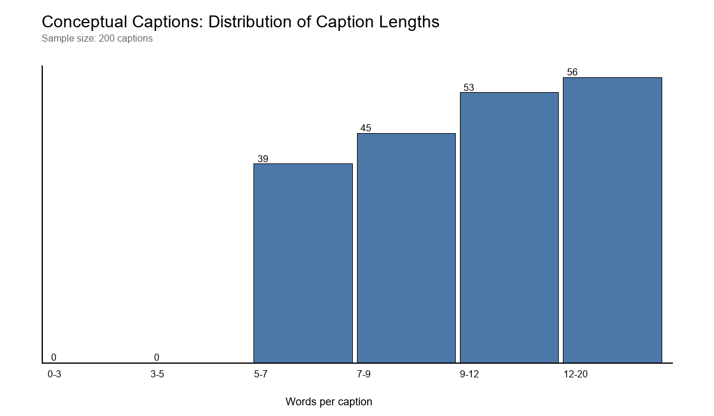
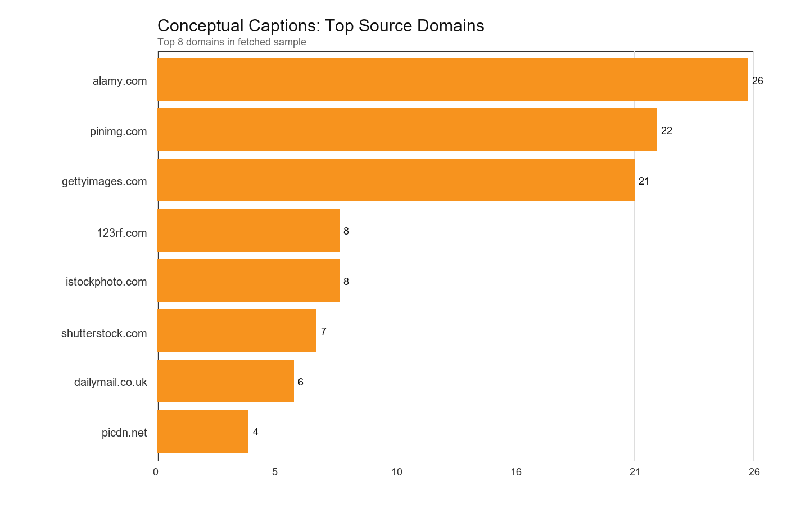
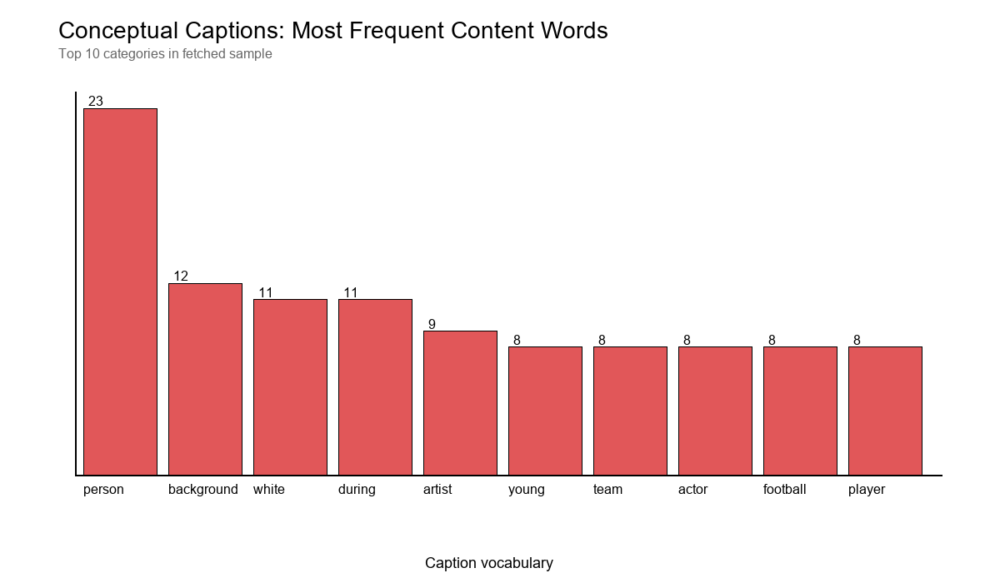
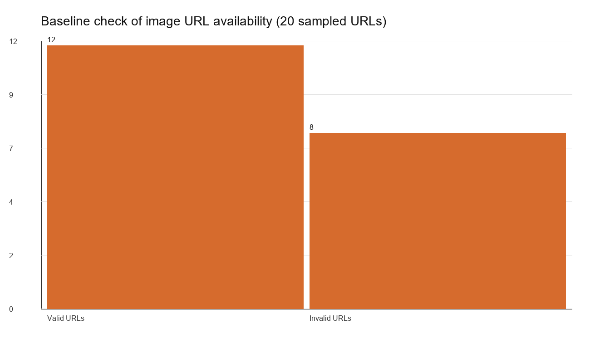
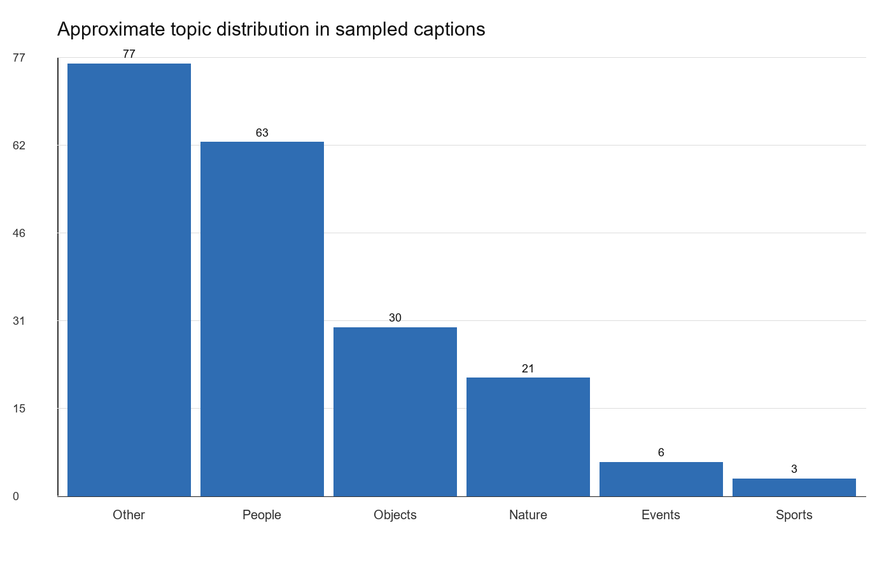
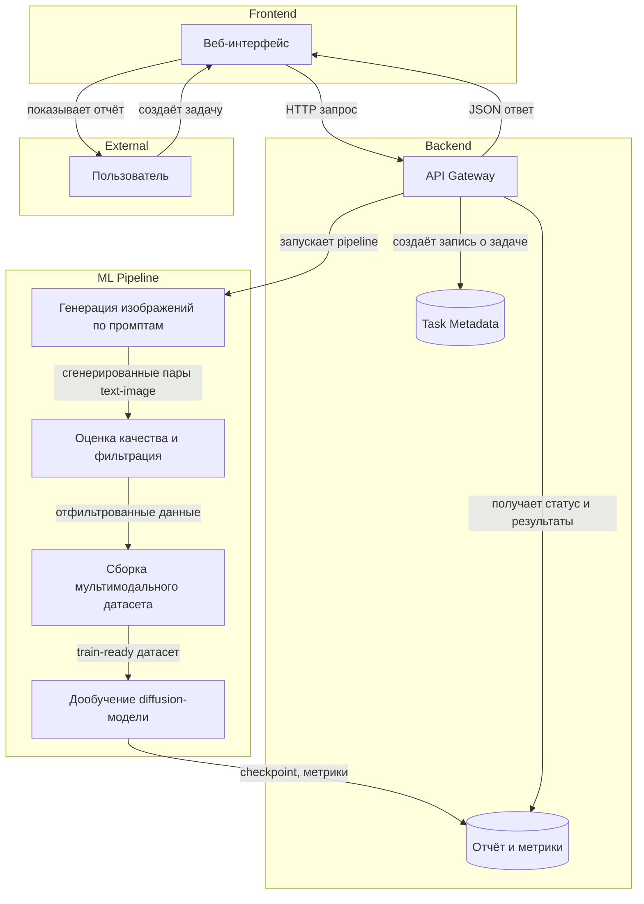
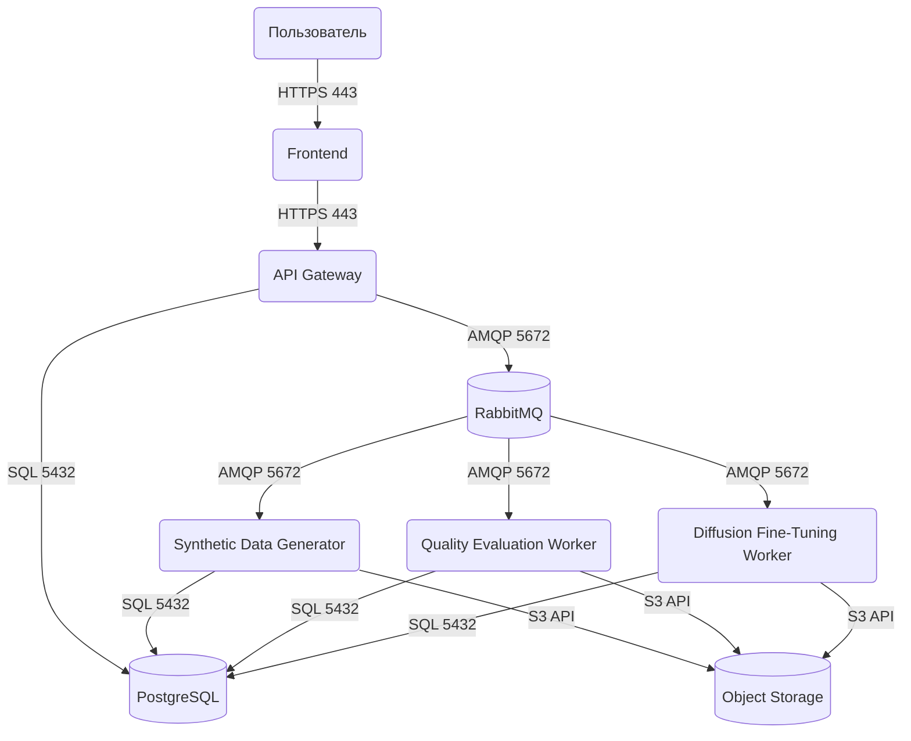

# Сервис генерации синтетических мультимодальных датасетов и дообучения диффузионных моделей

## Шаг 1. Выбор темы

**Выбранная тема:** Сервис генерации синтетических мультимодальных датасетов (текст + изображения) с дообучением диффузионных моделей

## Шаг 2. Формулировка бизнес-задачи и её ML-интерпретация

### 1) Какую проблему решает сервис?

Сервис решает проблему нехватки качественных размеченных мультимодальных данных для обучения и адаптации генеративных моделей. Во многих прикладных задачах собрать пары «текстовое описание - изображение» дорого, долго и юридически рискованно. Кроме того, реальные датасеты часто несбалансированы: в них мало редких классов, доменных сценариев и специальных визуальных условий. В результате модели хуже работают на целевой предметной области.

### 2) Какую выгоду он несет, и кто её получит?

-   **Выгода:** Снижение стоимости подготовки датасета, ускорение итераций в ML-разработке, покрытие редких сценариев, повышение качества доменно-специфичных генеративных моделей.

-   **Бенефициары:**

    -   ML-инженеры и исследователи - получают инструмент для быстрого построения обучающих выборок.
    -   Компания или лаборатория - сокращает затраты на ручную разметку и закупку данных.
    -   Аналитики качества - получают контролируемый конвейер генерации и валидации синтетических данных.

### 3) Зачем тут ML? Какая его функция?

ML является ядром сервиса. Диффузионная модель используется для генерации изображений по текстовым промптам, а сопутствующие модели качества оценивают соответствие изображения тексту, разнообразие выборки и пригодность данных для дообучения. Далее на синтетическом или смешанном датасете выполняется дообучение базовой diffusion-модели под конкретный домен.

### 4) Какие входные и выходные данные предполагаются?

**Входные данные:**

-   Набор текстовых промптов или шаблонов промптов.
-   Небольшой реальный seed-датасет пар `text-image` для калибровки и валидации.
-   Конфигурация генерации: стиль, домен, разрешение, число изображений на промпт, negative prompts.
-   Параметры дообучения модели: checkpoint базовой модели, learning rate, число эпох, batch size, LoRA/finetuning режим.

**Выходные данные:**

-   Синтетический мультимодальный датасет: изображения, тексты, метаданные и quality scores.
-   Отфильтрованный train/validation split.
-   Дообученный checkpoint модели или LoRA-адаптер.
-   Отчёт о качестве датасета и модели: метрики, примеры, распределения, проблемные случаи.

## Шаг 3. Определение метрик качества

### Бизнес-метрики

1.  **Стоимость одного валидного примера датасета:**  
    отношение общих вычислительных и операционных затрат к числу примеров, прошедших quality filter.  
    Цель - сделать подготовку данных дешевле ручного сбора и разметки.

2.  **Время подготовки датасета:**  
    полное время от загрузки конфигурации до получения готового train-ready набора.  
    Чем меньше этот показатель, тем быстрее исследовательские итерации.

3.  **Прирост качества downstream-модели:**  
    изменение пользовательских или экспертных оценок после дообучения на синтетических данных.  
    Это главная прикладная метрика полезности сервиса.

**Как качество модели влияет на бизнес:**  
Если синтетические данные нерелевантны, шумны или однообразны, дообучение может ухудшить итоговую модель и привести к лишним вычислительным затратам. Если же данные хорошо соответствуют целевому домену и покрывают редкие случаи, компания получает более точную и полезную генеративную систему при меньших расходах на сбор данных.

### ML-метрики

1.  **CLIPScore / Text-Image Similarity** - мера соответствия изображения текстовому описанию.  
    _Почему выбрана:_ Для мультимодального датасета важно, чтобы картинка действительно отражала промпт.  
    _Связь с бизнесом:_ Низкое соответствие ухудшает обучающую ценность примеров и снижает качество дообученной модели.

2.  **FID (Fréchet Inception Distance)** - расстояние между распределением синтетических и целевых изображений.  
    _Почему выбрана:_ Позволяет оценить реалистичность и близость генерации к нужному визуальному домену.  
    _Связь с бизнесом:_ Слишком большой FID означает, что модель генерирует «не тот» стиль или домен, а значит данные плохо подходят для обучения.

3.  **Intra-dataset Diversity Score** - показатель разнообразия изображений и текстов внутри датасета.  
    _Почему выбрана:_ Важно не только качество отдельных примеров, но и отсутствие mode collapse.  
    _Связь с бизнесом:_ Низкое разнообразие приводит к переобучению и слабой обобщающей способности модели.

4.  **Validation Loss / Preference Score после дообучения** - качество уже адаптированной diffusion-модели.  
    _Почему выбрана:_ Сервис создаётся не только ради данных, но и ради улучшения модели.  
    _Связь с бизнесом:_ Если метрики после fine-tuning не улучшаются, значит конвейер генерации не приносит практической пользы.

## Шаг 4. Источник данных и EDA

### 4.1 Источник данных

В качестве базового seed-датасета выбран **Conceptual Captions**. Это открытый мультимодальный датасет пар `изображение + текстовое описание`, который далее дополняется синтетическими примерами, сгенерированными diffusion-моделью.

Для проекта используется следующая схема данных:

-   **Базовый реальный датасет:** Conceptual Captions.
-   **Синтетическое расширение:** пары `prompt + generated image`, созданные после запуска генеративного пайплайна.
-   **Метаданные генерации для синтетической части:** `prompt`, `negative_prompt`, `seed`, `guidance_scale`, `num_inference_steps`, `model_version`, `resolution`, `style_tag`, `domain_tag`, `clip_score`, `quality_flag`.

Основные характеристики базового датасета:

-   **Тип данных:** мультимодальный, полуструктурированный.
-   **Единица наблюдения:** одна пара `текст - изображение`.
-   **Содержимое записи:** `image_url`, `caption`.
-   **Роль в проекте:** используется как стартовый реальный корпус, на основе которого выполняется анализ, фильтрация и последующее синтетическое расширение.
-   **Преимущество выбора:** это реальный датасет, поэтому на защите удобно показать, что синтетические данные не заменяют исходный корпус, а расширяют его.

### 4.2 Разведочный анализ данных (EDA)

#### 4.2.1 Первичный обзор

Для EDA был выполнен реальный кодовый анализ выборки из **200 записей** датасета Conceptual Captions, полученных через Hugging Face dataset server. На этом этапе анализировались доступные метаданные `caption` и `image_url`, так как исходный датасет очень большой и для учебного проекта достаточно показать EDA на рабочем сэмпле.

Результаты первичного обзора:

-   Размер анализируемой выборки: **200 строк**.
-   Средняя длина подписи: **9.74 слова**.
-   Медианная длина подписи: **9 слов**.
-   Средняя длина подписи в символах: **55.45**.
-   Минимальная длина подписи: **4 слова**.
-   Максимальная длина подписи: **30 слов**.
-   Количество уникальных доменов-источников изображений в выборке: **90**.

Вывод: даже на небольшом сэмпле видно, что датасет достаточно разнообразен по источникам и содержит короткие естественные описания, хорошо подходящие для задачи `text-image`.

#### 4.2.2 Baseline-метрики для сравнения с синтетическим датасетом

Так как далее сервис будет генерировать синтетические пары `текст + изображение`, в EDA полезно сразу зафиксировать базовые метрики реального seed-датасета, с которыми потом можно сравнивать синтетику.

Для текущей выборки получены следующие baseline-показатели:

-   Уникальных caption: **200 из 200**, дубликатов в сэмпле не найдено.
-   Доля дубликатов caption: **0.0%**.
-   Лексическое разнообразие текста: **0.6542**.
-   Доля коротких caption (меньше 6 слов): **14.5%**.
-   Доля длинных caption (больше 20 слов): **3.0%**.
-   Быстрая проверка доступности `image_url` на подвыборке из 20 ссылок показала **60% валидных URL**.

Эти показатели важны, потому что позже аналогичные метрики можно посчитать уже на синтетическом датасете и проверить:

-   не ухудшилось ли разнообразие текста;
-   не выросла ли доля дубликатов;
-   не появилось ли сильное смещение по тематикам;
-   не стало ли слишком много технически невалидных объектов.

#### 4.2.3 Очистка и подготовка

На этапе подготовки данных предполагаются следующие шаги:

-   удаление строк с пустыми или слишком короткими caption;
-   фильтрация битых и недоступных изображений по `image_url`;
-   нормализация текста: приведение к единому регистру, удаление лишних пробелов и мусорных токенов;
-   дедупликация пар с одинаковыми или почти одинаковыми caption;
-   формирование train/validation split;
-   добавление синтетической части датасета после генерации новых `text-image` пар.

Такой pipeline позволяет использовать Conceptual Captions как реальную основу, а затем расширить его синтетикой без смешения “сырого” и “очищенного” корпусов.

#### 4.2.4 Визуализация и анализ

**Распределение длины caption**

По графику видно, что большинство подписей лежит в диапазоне примерно от 5 до 12 слов. Это означает, что датасет содержит короткие описания объектов и сцен, что удобно для обучения text-to-image моделей.

**Топ доменов-источников изображений**

Наиболее часто в сэмпле встречаются домены `alamy`, `pinimg`, `gettyimages` и другие крупные источники изображений. Это показывает, что данные собраны из множества внешних сайтов, а значит требуют проверки качества и доступности ссылок.

**Самые частые содержательные слова в caption**

Частые слова вроде `person`, `background`, `white`, `team`, `football`, `player`, `car` показывают, что в выборке много описаний людей, событий, спортивных сцен и типовых объектов. Это полезно для понимания смещения датасета: без дополнительной балансировки модель может чаще видеть именно такие сюжеты.

**Проверка доступности изображений по `image_url`**

Даже на маленькой проверочной подвыборке видно, что часть ссылок уже недоступна. Для Conceptual Captions это важный практический вывод: перед обучением обязательно нужен этап фильтрации битых URL, иначе в train-ready набор попадут неполные записи.

**Приближенное распределение по тематикам**

Грубая тематическая разметка по ключевым словам показывает, что в сэмпле заметно преобладают описания людей и общих сцен, а спортивные сюжеты встречаются редко. Этот график полезен как baseline: потом можно сравнить его с синтетическим датасетом и проверить, не усилили ли мы тематический перекос.

#### 4.2.5 Агрегация данных для ML-модели

После очистки и расширения синтетическими примерами для дообучения diffusion-модели формируется обучающий набор следующего вида:

-   `image_path` - путь к изображению.
-   `text_caption` - итоговый текстовый промпт.
-   `domain_tag` - доменная метка.
-   `style_tag` - метка стиля.
-   `quality_score` - агрегированный score пригодности.
-   `source_type` - `real` или `synthetic`.

Дополнительно возможна балансировка:

-   по редким классам;
-   по визуальным стилям;
-   по длине и структуре текстового описания;
-   по source_type для смешанного обучения.

### 4.3 Выводы

-   Conceptual Captions подходит как базовый реальный датасет для проекта, потому что уже содержит пары `текст + изображение`.
-   Даже на сэмпле из 200 строк видно, что подписи компактны, а источники изображений разнообразны.
-   В датасете заметен перекос в сторону людей, событий и стоковых сцен, поэтому синтетическое расширение можно использовать для балансировки нужных доменных случаев.
-   Такой подход хорошо ложится на задачу ML System Design: сначала берётся реальный seed-датасет, затем он очищается, анализируется и дополняется синтетическими данными для дообучения diffusion-модели.

## Шаг 5. Проектирование высокоуровневой архитектуры системы

### 5.1 Общая идея системы

Система предоставляет пользователю интерфейс, в котором можно задать шаблоны промптов, параметры генерации и конфигурацию дообучения. После запуска пайплайна сервис асинхронно генерирует изображения, оценивает их качество, фильтрует неудачные примеры, собирает датасет, запускает fine-tuning диффузионной модели и сохраняет артефакты вместе с отчётом.

**Диаграмма 1. Что происходит в системе**

### 5.2 Основные сценарии работы

**5.2.1 Взаимодействие пользователя:**

1.  Пользователь задаёт параметры генерации датасета и загружает seed-данные через веб-интерфейс.
2.  Frontend отправляет конфигурацию в API Gateway.
3.  API создаёт задачу, сохраняет конфигурацию и публикует событие в очередь.
4.  Генератор синтетических данных создаёт пары `text-image`.
5.  Модуль quality evaluation фильтрует и ранжирует примеры.
6.  Training worker запускает дообучение diffusion-модели.
7.  Пользователь получает `task_id`, следит за прогрессом и скачивает итоговый датасет, отчёт и checkpoint.

**5.2.2 Откуда поступают данные для обучения / инференса:**

-   **Генерация датасета:** из пользовательских промптов, шаблонов и seed-датасета.
-   **Оценка качества:** из embeddings текстов и изображений, а также вспомогательных quality models.
-   **Дообучение:** из отфильтрованного мультимодального датасета, собранного текущим pipeline run.

**5.2.3 Куда сохраняются результаты:**  
Метаданные задач и статусы сохраняются в PostgreSQL. Изображения, датасеты, checkpoints и отчёты сохраняются в объектном хранилище. Краткие аналитические сводки и метрики сохраняются в таблицах `datasets`, `training_runs`, `artifacts`, `quality_reports`.

## Шаг 6. Выделение модулей и протоколов взаимодействия

### 6.1 Модули и их ответственность

**Диаграмма 2. Модули системы и протоколы взаимодействия**

1.  **Модуль пользовательского интерфейса (Frontend)**  
    _Ответственность:_ Настройка генерации, запуск пайплайна, просмотр прогресса, просмотр quality report и скачивание артефактов.  
    _Протоколы взаимодействия:_ HTTPS (REST/JSON) с API Gateway.

2.  **Модуль API Gateway**  
    _Ответственность:_ Приём запросов, валидация конфигураций, создание задач, управление статусами, выдача ссылок на артефакты.  
    _Протоколы взаимодействия:_ HTTPS для фронтенда, AMQP для публикации задач, SQL для записи метаданных.

3.  **Модуль генерации синтетических данных**  
    _Ответственность:_ Генерация изображений по промптам с помощью базовой diffusion-модели, сохранение изображений и метаданных.  
    _Протоколы взаимодействия:_ Получение задач через очередь, запись артефактов в object storage, сохранение статусов в PostgreSQL.

4.  **Модуль оценки качества**  
    _Ответственность:_ Подсчёт CLIPScore, фильтрация нежелательных примеров, дедупликация, расчёт diversity metrics.  
    _Протоколы взаимодействия:_ Чтение артефактов из object storage, запись quality report в PostgreSQL и storage.

5.  **Модуль дообучения diffusion-модели**  
    _Ответственность:_ Подготовка train-ready датасета, запуск fine-tuning или LoRA-tuning, логирование метрик, сохранение checkpoints.  
    _Протоколы взаимодействия:_ Чтение датасета из storage, запись метрик в PostgreSQL, сохранение модели в storage.

6.  **Модуль хранения данных**  
    _Ответственность:_ PostgreSQL хранит задачи, метрики, конфигурации и ссылки на артефакты; object storage хранит изображения, датасеты и модели.  
    _Протоколы взаимодействия:_ SQL и S3-compatible API.

### 6.2 Последовательность выполнения пайплайна

1.  Пользователь создаёт новый pipeline run через Frontend.
2.  API Gateway сохраняет конфигурацию и публикует задачу в RabbitMQ.
3.  Synthetic Data Generator генерирует изображения по промптам и сохраняет результаты в object storage.
4.  Quality Evaluation Worker вычисляет quality metrics, выполняет фильтрацию и формирует финальный датасет.
5.  Fine-Tuning Worker запускает дообучение diffusion-модели на подготовленном наборе данных.
6.  После завершения обучения сохраняются checkpoint, метрики и визуальный отчёт.
7.  Пользователь через API и Frontend получает доступ к датасету, метрикам и итоговой модели.

## Шаг 7. Предварительный выбор технологий и их обоснование

### 7.1 Frontend (React + TypeScript)

**Выбор:** React с TypeScript.  
**Обоснование:** Подходит для формы конфигурации сложного ML-пайплайна, отображения статусов задач, таблиц метрик и галерей изображений. TypeScript помогает контролировать типы API-ответов и конфигураций.  
**Отвергнутые альтернативы:** Vue.js - тоже подходит, но React чаще встречается в учебных и production ML-панелях; Angular - избыточен для проекта такого масштаба.

### 7.2 API Gateway (FastAPI)

**Выбор:** Python + FastAPI.  
**Обоснование:** В этом проекте логично использовать единый стек вокруг Python, так как генерация, оценка качества и fine-tuning тоже выполняются на Python. FastAPI даёт удобную типизацию, OpenAPI-документацию и быстрый старт.  
**Отвергнутые альтернативы:** Go дал бы лучшую производительность, но усложнил бы стек; Node.js менее естественен для плотной интеграции с ML-пайплайном.

### 7.3 Очередь сообщений (RabbitMQ)

**Выбор:** RabbitMQ.  
**Обоснование:** Сервис состоит из нескольких асинхронных этапов: генерация, оценка, обучение. RabbitMQ хорошо подходит для orchestration очередей задач и повторных попыток.  
**Отвергнутые альтернативы:** Kafka избыточен для учебного пайплайна; Redis Queue проще, но слабее как надёжная очередь для многошаговых задач.

### 7.4 База данных (PostgreSQL)

**Выбор:** PostgreSQL.  
**Обоснование:** Нужна надёжная реляционная база для хранения задач, конфигураций запусков, quality reports и ссылок на артефакты. PostgreSQL удобен для аналитических запросов и хорошо сочетается с JSON-полями.  
**Отвергнутые альтернативы:** MongoDB менее удобен для связанного хранения run metadata; SQLite не подходит для многопользовательского сервиса.

### 7.5 Объектное хранилище (S3/MinIO)

**Выбор:** S3-compatible storage, например MinIO локально или Amazon S3 в облаке.  
**Обоснование:** Изображения, архивы датасетов и checkpoints слишком велики для хранения в БД. Object storage лучше подходит для крупных бинарных артефактов.  
**Отвергнутые альтернативы:** Хранение файлов на локальном диске плохо масштабируется и осложняет переносимость системы.

### 7.6 ML-воркеры (Python, PyTorch, Diffusers)

**Выбор:** Python + PyTorch + Hugging Face Diffusers.  
**Обоснование:** Это де-факто стандарт для diffusion-моделей, генерации изображений и fine-tuning через LoRA, DreamBooth или кастомные training loops. Экосистема богата готовыми компонентами и примерами.  
**Отвергнутые альтернативы:** TensorFlow реже используется для современных diffusion pipelines; самописная реализация без Diffusers слишком трудоёмка для учебного проекта.

### 7.7 Оценка качества (CLIP, OpenCLIP, torchvision, faiss)

**Выбор:** CLIP/OpenCLIP для text-image similarity, `torchvision` для image preprocessing, `faiss` для поиска дубликатов и близких embedding-векторов.  
**Обоснование:** Эти инструменты позволяют реализовать фильтрацию, дедупликацию и quality scoring в одном Python-стеке.  
**Отвергнутые альтернативы:** Полностью ручная экспертная оценка не масштабируется; более тяжёлые multimodal evaluators избыточны для учебной системы.

### 7.8 Контейнеризация и оркестрация (Docker, Docker Compose)

**Выбор:** Docker и Docker Compose.  
**Обоснование:** Позволяют воспроизводимо поднимать API, БД, очередь, object storage и воркеры. Для учебного проекта этого достаточно.  
**Отвергнутые альтернативы:** Kubernetes слишком сложен для первой версии и увеличивает инфраструктурную нагрузку без существенной пользы для зачётного проекта.

### 7.9 Мониторинг экспериментов (MLflow или Weights & Biases)

**Выбор:** MLflow как базовый вариант.  
**Обоснование:** Нужно логировать параметры генерации, конфигурации fine-tuning, метрики качества и ссылки на checkpoints. MLflow хорошо подходит для учебной демонстрации полного experiment tracking контура.  
**Отвергнутые альтернативы:** Ведение логов только в файлах неудобно для сравнения запусков; Weights & Biases тоже хорош, но требует внешней интеграции и аккаунта.
